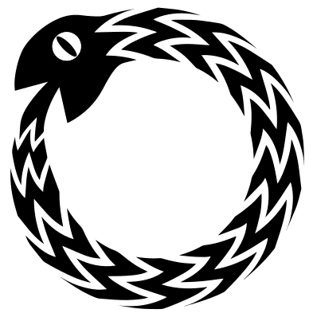

<h1 id="about">About Me</h1>
<section class="about">
  
I am a full-stack software engineer with a background in biology. I write web applications that emphasize ease-of-use and scalability, reflecting a performant, well-tested, and maintainable codebase. My scientific training taught me to think critically and avoid assumptions, which are skills I bring to bear on all the code I write.

</section>

<h1 id="projects">Projects</h1>
<section class="project">
  <aside>
    <h2>Ouroboros</h2>
    
    <a class="content-btn" href="https://ouroboros-game.herokuapp.com">Play the Game</a>
    <a class="content-btn" href="https://github.com/ouroboros-team/ouroboros">View the Code</a>
  </aside>
  <section class="desc">
    
Ouroboros is a reflex-based, peer-to-peer game that runs in the browser, modeled off of the game Snake.

      <ul>
        <li>Utilizes a Conflict-free Replicated Data Type (CRDT) to ensure eventual consistency of game state across peers</li>
        <li>Predictive algorithms improve user experience in absence of peer data</li>
        <li>Achieves fast collision checking and display rendering via an intermediary data structure with O(1) lookup</li>
        <li>Data buffers ensure accurate winner determination and smooth end-of-game transition for all peers</li>
        <li>Full-mesh network topology allows for lowest possible latency between peers</li>
        <li>Establishs peer connections via WebRTC</li>
      </ul>
  </section>
</section>
<section class="project">
  <aside>
    <h2>Reaction</h2>
    <a class="content-btn" href="https://reaction-trello-clone.herokuapp.com/">See the demo</a>
  </aside>
  <section class="desc">
    
Reaction is a clone of the project management software, Trello.

    <ul>
        <li>Allows users to add, remove, search, label, and reorganize lists and cards.</li>
        <li>Rails backend and React frontend</li>
    </ul>  
  </section>
</section>

<h1 class="skills">Skills</h1>
<section class="skills">
  <h2>Languages</h2>
  <ul>
    <li>Javascript</li>
    <li>Ruby</li>
    <li>SQL</li>
    <li>HTML</li>
    <li>CSS</li>
  </ul>
  <h2>Frameworks and Technologies</h2>
  <ul>
    <li>React</li>
    <li>Redux</li>
    <li>Ruby on Rails</li>
    <li>Sinatra</li>
    <li>Git</li>
    <li>WebRTC</li>
  </ul>
</section>
<h1 id="contact">Contact</h1>
<section class="contact">
  <ul>
    <li><a href="mailto:grant.davis.reed@gmail.com">Email</a></li>
    <li><a href="https://linkedin.com/in/grant-d-reed">LinkedIn</a></li>
    <li><a href="https://github.com/grantdreed">Github</a></li>
  </ul>
</section>
                                         

